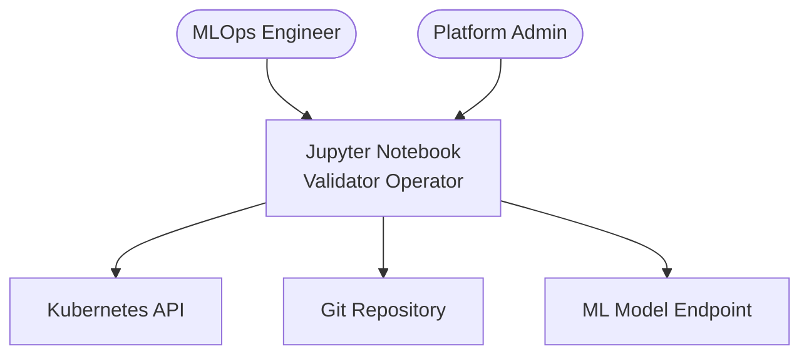
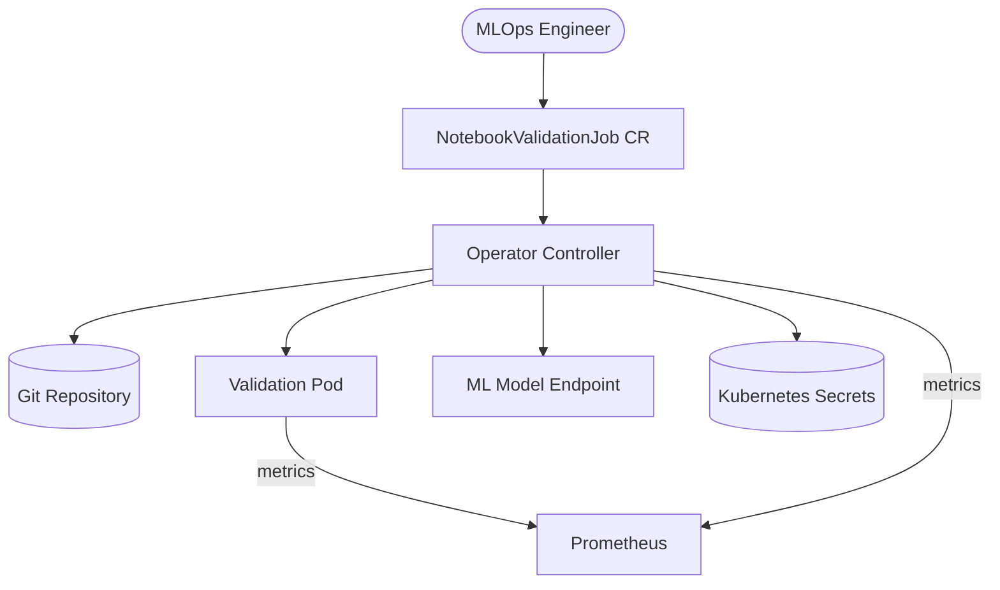
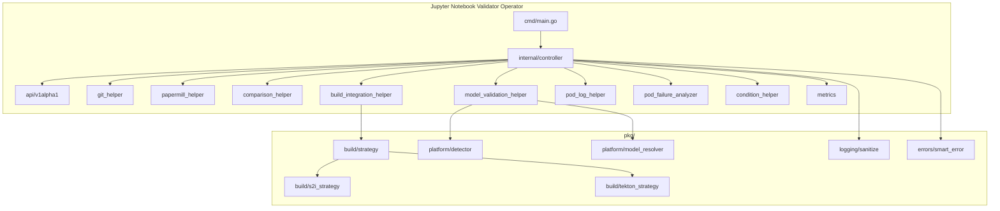
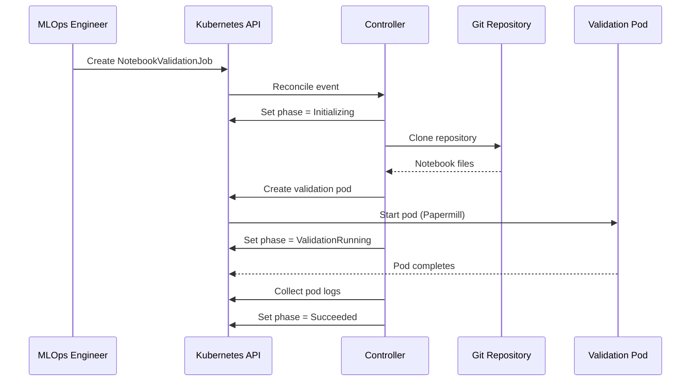
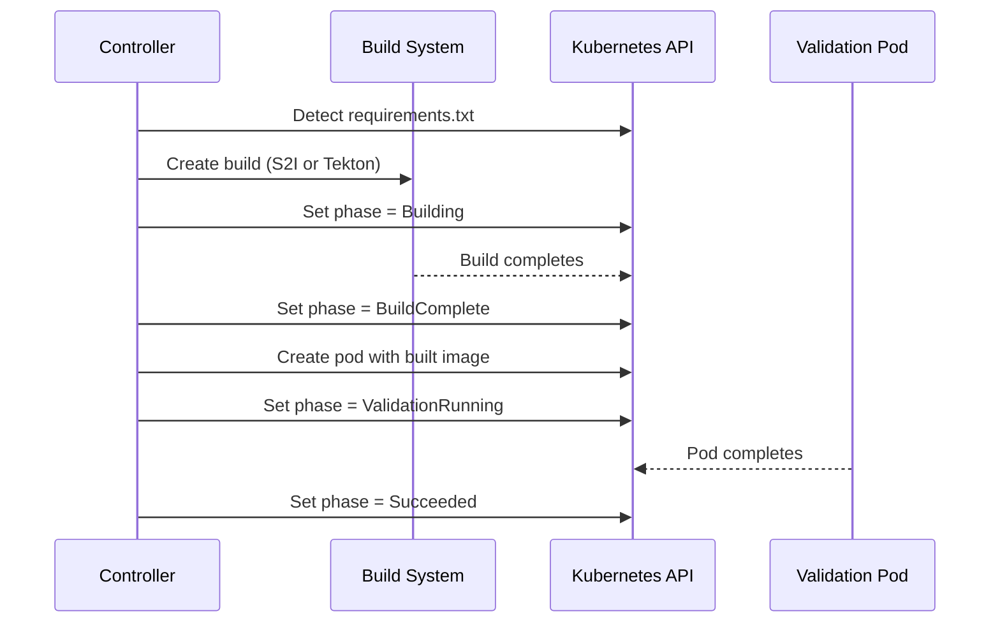
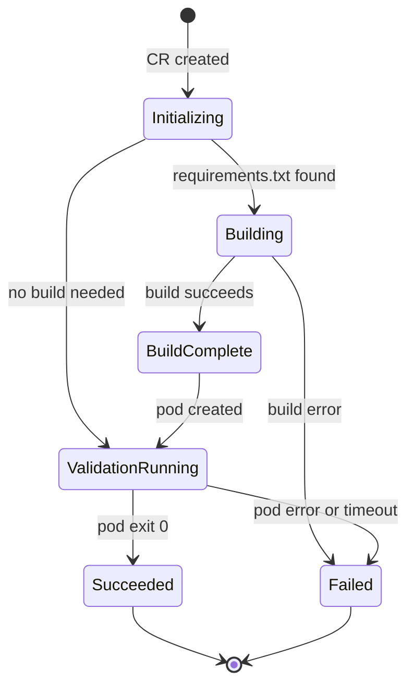
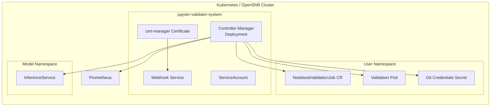

# DESIGN_DOC.md

**System:** Jupyter Notebook Validator Operator  
**Version:** 1.0.9  
**Status:** Accepted  
**Audience:** Architects, implementers, reviewers  
**Voice:** STE100  
**Related requirements:** `docs/adrs/`, `README.md`

---

## 1. Introduction and goals

The Jupyter Notebook Validator Operator is a Kubernetes-native operator that automates Jupyter notebook validation in MLOps workflows. It clones a notebook from a Git repository, executes it inside an isolated pod with Papermill, and compares the output against a golden notebook. The operator also validates notebooks against deployed ML models on platforms such as KServe, OpenShift AI, and vLLM.

The operator is built with the Operator SDK (v1.37.0) and Go 1.24. It runs on OpenShift 4.20, 4.21, and 4.22 (certified per ADR-056) and on vanilla Kubernetes 1.31 and later.

### 1.1 Quality goals

| ID | Goal | Scenario |
|----|------|----------|
| QG-1 | Isolation | Each validation job runs in its own pod. One failure does not affect another job. |
| QG-2 | Observability | Prometheus metrics, structured JSON logs, and OpenShift Console dashboards expose every stage of the reconciliation loop. |
| QG-3 | Portability | The same CRD and controller run on OpenShift and vanilla Kubernetes. Build strategy selection is automatic. |
| QG-4 | Security | Credentials are injected from Kubernetes Secrets or ESO. Logs are sanitized to remove sensitive values. The operator runs as non-root in a distroless container. |
| QG-5 | Extensibility | New build backends and model serving platforms can be added without changes to the controller. |

### 1.2 Stakeholders

| Stakeholder | Expectation |
|-------------|-------------|
| MLOps engineer | Submit a `NotebookValidationJob` CR and receive a pass or fail result with cell-level detail. |
| Platform administrator | Install the operator with Helm or OLM and monitor it with Prometheus. |
| Data scientist | Run notebooks against a deployed model and confirm inference accuracy within tolerance. |
| Contributor | Understand the architecture, run tests locally, and add a new build strategy or platform detector. |



---

## 2. Constraints

- **Language:** Go 1.24 with controller-runtime v0.17.
- **Platforms:** OpenShift 4.20 through 4.22 (certified). Kubernetes 1.31 and later. OpenShift 4.19 is best-effort only (ADR-056).
- **Build tools:** Operator SDK v1.37.0, Kustomize, Helm 3, OLM.
- **Container base:** `gcr.io/distroless/static:nonroot`. The operator binary runs as UID 65532.
- **License:** Apache License 2.0.
- **CI:** GitHub Actions with golangci-lint v2.11.4, Ginkgo for E2E tests, Kind and live OpenShift clusters.

---

## 3. Context and scope

The operator watches `NotebookValidationJob` custom resources. When a CR is created, the controller clones a Git repository, creates a validation pod, monitors its execution, and updates the CR status.

**In scope:**
- Git clone (HTTPS, SSH, `git@host:path`)
- Papermill execution in an isolated pod
- Golden notebook comparison with configurable tolerances
- Model validation against nine serving platforms
- Build integration (S2I, Tekton) for dependency resolution
- Prometheus metrics and Grafana dashboards

**Out of scope:**
- Notebook authoring or editing
- Model training or deployment
- Cluster provisioning



---

## 4. Solution strategy

The design follows the Kubernetes operator pattern. A single controller reconciles `NotebookValidationJob` resources through a deterministic state machine.

Key architectural decisions (58 ADRs in `docs/adrs/`):

- **ADR-001:** Operator SDK v1.37.0 with controller-runtime.
- **ADR-003:** Single CRD (`NotebookValidationJob`) at `v1alpha1`.
- **ADR-009:** Git credentials from Kubernetes Secrets with HTTPS and SSH support.
- **ADR-020:** Model-aware validation with auto-detection of nine serving platforms.
- **ADR-023:** S2I build integration for OpenShift.
- **ADR-037:** State machine with phases: Initializing, Building, BuildComplete, ValidationRunning, Succeeded, Failed.
- **ADR-041:** Exit code validation and developer safety framework.
- **ADR-056:** Certified support window: OpenShift 4.20, 4.21, 4.22.

---

## 5. Building block view

| Building block | Responsibility | Key ADRs |
|----------------|----------------|----------|
| `api/v1alpha1/` | CRD type definitions, webhook validation, deep copy | ADR-003 |
| `cmd/main.go` | Entrypoint. Registers schemes, starts manager. | ADR-001 |
| `internal/controller/` | Reconciliation loop and helper modules | ADR-037 |
| `pkg/build/` | Pluggable build strategy interface (S2I, Tekton) | ADR-023, ADR-028 |
| `pkg/platform/` | ML platform detection and model resolution | ADR-020 |
| `pkg/logging/` | Log sanitization for credential scrubbing | ADR-009 |
| `pkg/errors/` | Smart error messages with knowledge base | ADR-030 |
| `helm/` | Helm chart for Kubernetes and OpenShift deployment | ADR-004 |
| `config/` | Kustomize overlays, RBAC, CRD, webhooks, monitoring | ADR-005, ADR-010 |
| `bundle/` | OLM bundle for OperatorHub distribution | ADR-007 |



### 5.1 Directory tree

```text
.
├── api/v1alpha1/                  # CRD types, webhook, deep copy
├── cmd/main.go                    # Operator entrypoint
├── internal/controller/
│   ├── notebookvalidationjob_controller.go  # Main reconciler
│   ├── git_helper.go              # Git clone (HTTPS, SSH)
│   ├── papermill_helper.go        # Validation pod creation
│   ├── comparison_helper.go       # Golden notebook diff
│   ├── model_validation_helper.go # Model inference checks
│   ├── build_integration_helper.go # S2I and Tekton builds
│   ├── pod_log_helper.go          # Pod log collection
│   ├── pod_failure_analyzer.go    # Failure diagnosis
│   ├── condition_helper.go        # Status condition updates
│   ├── metrics.go                 # Prometheus metrics
│   ├── constants.go               # Phase and condition constants
│   └── argocd/                    # Argo CD sync wave integration
├── pkg/
│   ├── build/
│   │   ├── strategy.go            # Strategy interface and registry
│   │   ├── s2i_strategy.go        # OpenShift S2I builds
│   │   ├── tekton_strategy.go     # Tekton Pipeline builds
│   │   └── openshiftai.go         # OpenShift AI workbench
│   ├── platform/
│   │   ├── detector.go            # Platform auto-detection
│   │   └── model_resolver.go      # Model endpoint resolution
│   ├── logging/
│   │   └── sanitize.go            # Credential scrubbing
│   └── errors/
│       └── smart_error.go         # Context-aware error messages
├── config/                        # Kustomize manifests
├── helm/                          # Helm chart
├── bundle/                        # OLM bundle
└── test/                          # E2E and integration tests
```

---

## 6. Runtime view

### 6.1 Standard validation (no build)



### 6.2 Validation with build



### 6.3 Job lifecycle



---

## 7. Deployment view



**Runtime details:**

- The controller manager runs as a single-replica Deployment.
- Leader election prevents split-brain when multiple replicas are configured.
- The webhook service validates and defaults `NotebookValidationJob` CRs.
- cert-manager issues TLS certificates for the webhook endpoint.
- Prometheus scrapes the `/metrics` endpoint on port 8080.
- The validation pod runs in the same namespace as the CR.

**Installation methods:**

| Method | Command |
|--------|---------|
| Helm | `helm install jupyter-validator helm/jupyter-notebook-validator-operator` |
| Kustomize | `kubectl apply -k config/default` |
| OLM | Install from OperatorHub catalog |

---

## 8. Crosscutting concepts

- **Logging and tracing:** Structured JSON logs via `controller-runtime/pkg/log`. All credential values are scrubbed by `pkg/logging/sanitize.go` before output.
- **Authentication:** Git credentials from Kubernetes Secrets (HTTPS username/password or SSH private key). ESO and Vault integration for dynamic secret rotation (ADR-016, ADR-017).
- **Error handling:** Smart error messages with a YAML knowledge base (`pkg/errors/knowledge_base.yaml`). Pod failure analysis with context-aware diagnosis. Maximum three retries per reconciliation loop.
- **Configuration:** The `NotebookValidationJob` CRD carries all configuration. The operator reads no external config files. Default values are set by the mutating webhook.
- **Extensibility:** New build strategies implement the `build.Strategy` interface and register with the `build.Registry`. New model platforms add a `PlatformDefinition` entry in `pkg/platform/detector.go`.
- **Metrics:** Nine Prometheus metrics cover reconciliation duration, validation counts, Git clone performance, active pods, model validation timing, health checks, prediction results, and platform detection.
- **RBAC:** ClusterRole with least-privilege access to pods, secrets, builds, pipelines, and inference services. Validation pods use a dedicated ServiceAccount.

---

## 9. Architectural decisions

This project maintains 58 ADRs in `docs/adrs/`. The following are the most significant.

### ADR-001: Operator Framework and SDK Version

**Status:** Accepted  
**Decision:** Use Operator SDK v1.37.0 with controller-runtime.  
**Consequences:** Mature Go-based reconciliation. Helm and OLM packaging. Operator Lifecycle Manager support for OperatorHub.

### ADR-003: CRD Schema Design

**Status:** Accepted  
**Decision:** Single CRD `NotebookValidationJob` at API version `v1alpha1` under `mlops.mlops.dev`.  
**Consequences:** One resource covers notebook source, pod config, golden comparison, model validation, and build config. Webhook validation enforces field constraints.

### ADR-020: Model-Aware Validation

**Status:** Accepted  
**Decision:** Auto-detect model serving platforms by probing Kubernetes API groups.  
**Consequences:** Supports KServe, OpenShift AI, vLLM, TorchServe, TensorFlow Serving, Triton, Ray Serve, Seldon, and BentoML without user configuration.

### ADR-037: Build-Validation Sequencing

**Status:** Accepted  
**Decision:** Six-phase state machine: Initializing, Building, BuildComplete, ValidationRunning, Succeeded, Failed.  
**Consequences:** Clear lifecycle tracking. Each phase maps to a Kubernetes condition. Backward-compatible Pending and Running aliases.

### ADR-056: OpenShift Support Window

**Status:** Accepted  
**Decision:** Certify OpenShift 4.20, 4.21, and 4.22. Drop 4.18 (EoL). 4.19 is best-effort.  
**Consequences:** Three-version rolling window. CSV annotations target `v4.20-v4.22`. Release branches follow the pattern `release-4.XX`.

The complete list is in `docs/adrs/README.md`.

---

## 10. Quality requirements

| ID | Requirement | Risk | Verify |
|----|-------------|------|--------|
| NFR-001 | Reconciliation completes within 60 seconds for jobs without builds. | Medium | Prometheus histogram `reconciliation_duration_seconds` |
| NFR-002 | The operator runs as non-root (UID 65532) in a distroless container. | Low | Dockerfile, Pod Security Standards audit |
| NFR-003 | Credential values never appear in logs or status fields. | High | `pkg/logging/sanitize_test.go` |
| NFR-004 | The operator handles concurrent validation jobs without resource conflicts. | Medium | ADR-052, integration tests |
| NFR-005 | Build PVCs are unique per job to prevent data corruption in concurrent builds. | Medium | ADR-040, `pkg/build/tekton_strategy.go` |
| NFR-006 | All API changes pass webhook validation before persistence. | Low | `api/v1alpha1/notebookvalidationjob_webhook_test.go` |

---

## 11. Risks and technical debt

| Risk | Owner | Mitigation |
|------|-------|------------|
| API is `v1alpha1`. Breaking changes require a migration path before `v1`. | Maintainer | ADR-003 documents the version strategy. |
| S2I support depends on OpenShift Build API. Not available on vanilla Kubernetes. | Contributor | Tekton strategy provides a Kubernetes-native alternative. |
| Nine platform detectors probe the API server on each reconciliation. | Contributor | Cache detection results. Add a TTL-based refresh (tracked as tech debt). |
| Golden notebook comparison is cell-by-cell. Large notebooks increase memory use. | Contributor | Add streaming comparison for notebooks above a configurable size. |
| Argo CD integration is early-stage. Sync wave annotations may conflict with other controllers. | Maintainer | ADR-049 documents the approach. Feature is optional and disabled by default. |

---

## 12. Glossary

| Term | Meaning |
|------|---------|
| CRD | Custom Resource Definition. A Kubernetes API extension. |
| CR | Custom Resource. An instance of a CRD. |
| Papermill | A Python tool that executes Jupyter notebooks and parameterizes them. |
| Golden notebook | A reference notebook with known-good outputs for comparison. |
| S2I | Source-to-Image. An OpenShift build strategy that creates container images from source code. |
| Tekton | A Kubernetes-native CI/CD framework based on pipelines and tasks. |
| KServe | A Kubernetes-native model serving platform for inference workloads. |
| OLM | Operator Lifecycle Manager. Manages operator installation and upgrades on OpenShift. |
| ESO | External Secrets Operator. Syncs secrets from external providers into Kubernetes. |
| ADR | Architecture Decision Record. Documents a significant design choice with context and consequences. |
| SCC | Security Context Constraint. An OpenShift resource that controls pod security permissions. |
| Reconciliation | The controller-runtime loop that drives the actual cluster state toward the desired state. |
| Distroless | A minimal container base image that contains only the application binary and its runtime dependencies. |
| CSV | ClusterServiceVersion. An OLM resource that describes an operator version for OperatorHub. |

---

### Required figures

This document includes the following figures:

1. Context flowchart (section 3)
2. Building-block flowchart (section 5)
3. Sequence diagram: standard validation (section 6.1)
4. Sequence diagram: validation with build (section 6.2)
5. State diagram: job lifecycle (section 6.3)
6. Deployment flowchart (section 7)

The operator does not have a user-facing UI. It is controlled entirely through `kubectl` and Kubernetes CRs. No wireframes are applicable.
