# Jupyter Notebook Validator Operator

Catch notebook regressions and broken model endpoints before they reach production. Run notebooks in the same environment as production, compare outputs against golden baselines, and validate live ML models.

[](https://opensource.org/licenses/Apache-2.0)
[](https://goreportcard.com/report/github.com/tosin2013/jupyter-notebook-validator-operator)
[](https://github.com/tosin2013/jupyter-notebook-validator-operator/actions/workflows/ci.yml)
[](https://github.com/tosin2013/jupyter-notebook-validator-operator/actions/workflows/ci-unit-tests.yaml)
[](https://github.com/tosin2013/jupyter-notebook-validator-operator/actions/workflows/e2e-kind.yaml)
[](https://github.com/tosin2013/jupyter-notebook-validator-operator/actions/workflows/e2e-openshift.yaml)
[](https://www.openshift.com/)
[](https://kubernetes.io/)
[](https://operatorhub.io/operator/jupyter-notebook-validator-operator)
[](https://tosin2013.github.io/jupyter-notebook-validator-operator/)

## Who is this for?

**Data Scientists and Notebook Authors.** Your notebook works on your laptop. Will it work in production? Validate notebooks locally with Podman or Docker before submitting to a cluster. Catch cell-output regressions, confirm model endpoint predictions, and stop silent failures before they reach your team.


- Start on your laptop: [Validate a notebook locally](docs/tutorials/LOCAL_VALIDATION.md) (no cluster needed)
- Submit to a cluster: [Quick Start](docs/tutorials/QUICK_START_CI_CD.md) and [`config/samples/`](config/samples/)

**Platform Engineers and Operator Contributors.** CI scripts check whether a notebook executed. They do not check whether outputs are correct, model predictions are valid, or cell outputs regressed from last week. This operator adds a declarative validation gate to your MLOps pipeline with Prometheus metrics, RBAC, and multi-tenant safety.


- Architecture: [Architecture](#architecture) and [DESIGN_DOC.md](DESIGN_DOC.md)
- Development: [CONTRIBUTING.md](CONTRIBUTING.md)

**Full workflow: Laptop → Cluster.** Validate locally first, then promote the same notebook to OpenShift with a single `oc apply`. Same notebook, same result, production-grade guardrails.


## Why this operator?

### For data scientists

- **Same-environment validation.** Notebooks run in the same cluster, with the same GPU, memory, and model endpoints as production. No more "works on my laptop" failures.
- **Golden notebook comparison.** Cell-by-cell output diff with configurable numeric tolerances. Catches silent regressions that `nbconvert --execute` misses.
- **Model endpoint validation.** Auto-detect 9 model serving platforms and confirm predictions are correct, not just that the notebook ran.

### For platform engineers

- **Declarative validation gate.** One CR defines the notebook, the golden baseline, and the model endpoint. Queryable with kubectl, Prometheus metrics included.
- **Multi-tenant security.** RBAC, Pod Security Standards, credential sanitization. Data scientists get validation results without cluster-admin.
- **Pluggable build and serve.** S2I, Tekton, KServe, OpenShift AI, vLLM, and 6 more platforms. Add new backends without changing the controller.

> **How is this different from nbval, Papermill, or Deepchecks?** Those tools run on your laptop or in CI. They cannot test whether your notebook works with production GPU, secrets, and model endpoints. This operator runs validation inside Kubernetes, in the same environment as production. See [Architecture Overview](docs/explanation/ARCHITECTURE_OVERVIEW.md) for details.

## Architecture

```mermaid
flowchart LR
    User["User / CI"] -->|"kubectl apply"| CR["NotebookValidationJob CR"]
    CR --> Controller["Operator Controller"]
    Controller -->|"clone"| Git["Git Repository"]
    Controller -->|"create"| Pod["Validation Pod"]
    Pod -->|"execute via Papermill"| Notebook["Jupyter Notebook"]
    Controller -->|"compare"| Golden["Golden Notebook"]
    Controller -->|"validate"| Model["ML Model Endpoint"]
    Controller -->|"update"| Status["Job Status"]
```



## Quick Start

### Option A: Helm (recommended)

```bash
helm repo add jupyter-validator https://tosin2013.github.io/jupyter-notebook-validator-operator
helm install jupyter-validator jupyter-validator/jupyter-notebook-validator-operator \
  --namespace jupyter-validator-system --create-namespace
```

### Option B: Build from source

```bash
make install
make docker-build docker-push IMG=quay.io/tosin2013/jupyter-notebook-validator-operator:v0.1.0
make deploy IMG=quay.io/tosin2013/jupyter-notebook-validator-operator:v0.1.0
```

### Verify

```bash
kubectl get pods -n jupyter-notebook-validator-operator-system
kubectl get crd notebookvalidationjobs.mlops.mlops.dev
```

### Prerequisites

- OpenShift 4.20+ or Kubernetes 1.31+
- `kubectl` or `oc` CLI
- Optional: External Secrets Operator, KServe / OpenShift AI, Tekton Pipelines

## Usage

Apply a `NotebookValidationJob` to run and validate a notebook:

```yaml
apiVersion: mlops.mlops.dev/v1alpha1
kind: NotebookValidationJob
metadata:
  name: simple-validation
spec:
  notebook:
    git:
      url: https://github.com/tosin2013/jupyter-notebook-validator-test-notebooks.git
      ref: main
    path: notebooks/tier1-simple/01-hello-world.ipynb
  podConfig:
    containerImage: quay.io/jupyter/scipy-notebook:latest
```

More examples in [config/samples/](config/samples/), including GPU scheduling, golden notebook comparison, model validation, credential injection, and Tekton builds.

## Key Features

| Feature | Description |
|---|---|
| Notebook execution | Isolated Kubernetes pods with Papermill |
| Golden comparison | Cell-by-cell output diff with numeric tolerances |
| Credential injection | Kubernetes Secrets, ESO, HashiCorp Vault |
| Model validation | KServe, OpenShift AI, vLLM, TorchServe, TensorFlow Serving, Triton, Ray Serve, Seldon, BentoML |
| Git integration | HTTPS and SSH authentication |
| Build integration | S2I and Tekton for custom dependency images |
| Observability | Prometheus metrics, structured logging, credential sanitization |
| Scheduling | GPU tolerations, node selectors, affinity rules |

## Documentation

See [docs/](docs/) for the full index, organized by [Diataxis](https://diataxis.fr/) quadrant:

- **[Tutorials](docs/tutorials/)** -- step-by-step lessons (local validation, quick start, ML workflows)
- **[How-to guides](docs/how-to/)** -- task recipes (credentials, model discovery, releases, CI setup)
- **[Reference](docs/reference/)** -- technical descriptions (testing, platform compatibility, observability)
- **[Explanation](docs/explanation/)** -- architecture, build strategies, deployment patterns
- **[Design Document](DESIGN_DOC.md)** -- arc42 software design document
- **[ADRs](docs/adrs/)** -- architectural decision records

## Contributing

Contributions are welcome from both **data scientists** (validate notebooks, report issues, improve docs) and **operator developers** (Go, controller-runtime, Kubernetes). See [CONTRIBUTING.md](CONTRIBUTING.md) for the path that matches your role.

## Code of Conduct

This project follows the [Contributor Covenant](CODE_OF_CONDUCT.md).

## Community

- [GitHub Issues](https://github.com/tosin2013/jupyter-notebook-validator-operator/issues) -- bugs and feature requests
- [GitHub Discussions](https://github.com/tosin2013/jupyter-notebook-validator-operator/discussions) -- Q&A and usage patterns
- [OperatorHub.io](https://operatorhub.io/operator/jupyter-notebook-validator-operator) -- OLM distribution
- [Artifact Hub](https://artifacthub.io/packages/search?ts_query=jupyter-notebook-validator-operator) -- Helm distribution

## License

Copyright 2025 Tosin Akinosho. Licensed under the [Apache License, Version 2.0](LICENSE).
