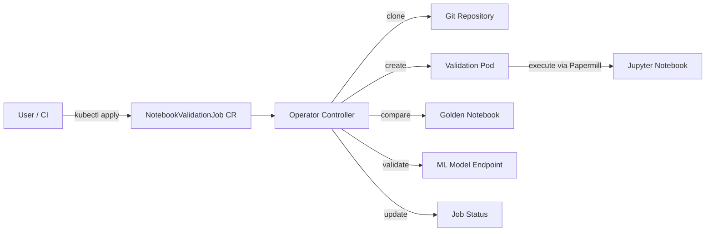

# Jupyter Notebook Validator Operator

Automate Jupyter Notebook testing in Kubernetes and OpenShift. Run notebooks, compare outputs against golden references, and validate against live ML models -- all from a single custom resource.

[](https://opensource.org/licenses/Apache-2.0)
[](https://goreportcard.com/report/github.com/tosin2013/jupyter-notebook-validator-operator)
[](https://github.com/tosin2013/jupyter-notebook-validator-operator/actions/workflows/ci.yml)
[](https://github.com/tosin2013/jupyter-notebook-validator-operator/actions/workflows/ci-unit-tests.yaml)
[](https://github.com/tosin2013/jupyter-notebook-validator-operator/actions/workflows/e2e-kind.yaml)
[](https://github.com/tosin2013/jupyter-notebook-validator-operator/actions/workflows/e2e-openshift.yaml)
[](https://www.openshift.com/)
[](https://kubernetes.io/)
[](https://operatorhub.io/operator/jupyter-notebook-validator-operator)

## Who is this for?

**Data Scientists and Notebook Authors.** You write notebooks and want to validate them on a cluster. You do not need Go or a local cluster. Start at [Quick Start](#quick-start), then see [`config/samples/`](config/samples/) for ready-to-use examples. Read [CONTRIBUTING.md](CONTRIBUTING.md) for how to report issues and improve docs.

**Platform Engineers and Operator Contributors.** You deploy, operate, or modify the operator itself. Start at [Architecture](#architecture) for a high-level view of the controller, then see [DESIGN_DOC.md](DESIGN_DOC.md) for the full arc42 design document. Read [CONTRIBUTING.md](CONTRIBUTING.md) for the Go development setup and pull request process.

## Why this operator?

- **Notebook regression testing.** Compare executed outputs cell-by-cell against golden notebooks with configurable numeric tolerances.
- **Model-aware validation.** Auto-detect 9 model serving platforms (KServe, OpenShift AI, vLLM, Triton, and more) and inject endpoints into notebooks.
- **Git-native.** Clone notebooks from any Git repository (HTTPS or SSH). Credentials stay in Kubernetes Secrets.
- **Zero custom images needed.** Auto-detect `requirements.txt` and build images with S2I or Tekton -- or bring your own.

## Architecture



## Quick Start

### Option A: Helm (recommended)

```bash
helm repo add jupyter-validator https://tosin2013.github.io/jupyter-notebook-validator-operator
helm install jupyter-validator jupyter-validator/jupyter-notebook-validator-operator \
  --namespace jupyter-validator-system --create-namespace
```

### Option B: Build from source

```bash
make install
make docker-build docker-push IMG=quay.io/tosin2013/jupyter-notebook-validator-operator:v0.1.0
make deploy IMG=quay.io/tosin2013/jupyter-notebook-validator-operator:v0.1.0
```

### Verify

```bash
kubectl get pods -n jupyter-notebook-validator-operator-system
kubectl get crd notebookvalidationjobs.mlops.mlops.dev
```

### Prerequisites

- OpenShift 4.20+ or Kubernetes 1.31+
- `kubectl` or `oc` CLI
- Optional: External Secrets Operator, KServe / OpenShift AI, Tekton Pipelines

## Usage

Apply a `NotebookValidationJob` to run and validate a notebook:

```yaml
apiVersion: mlops.mlops.dev/v1alpha1
kind: NotebookValidationJob
metadata:
  name: simple-validation
spec:
  notebook:
    git:
      url: https://github.com/tosin2013/jupyter-notebook-validator-test-notebooks.git
      ref: main
    path: notebooks/tier1-simple/01-hello-world.ipynb
  podConfig:
    containerImage: quay.io/jupyter/scipy-notebook:latest
```

More examples in [config/samples/](config/samples/), including GPU scheduling, golden notebook comparison, model validation, credential injection, and Tekton builds.

## Key Features

| Feature | Description |
|---|---|
| Notebook execution | Isolated Kubernetes pods with Papermill |
| Golden comparison | Cell-by-cell output diff with numeric tolerances |
| Credential injection | Kubernetes Secrets, ESO, HashiCorp Vault |
| Model validation | KServe, OpenShift AI, vLLM, TorchServe, TensorFlow Serving, Triton, Ray Serve, Seldon, BentoML |
| Git integration | HTTPS and SSH authentication |
| Build integration | S2I and Tekton for custom dependency images |
| Observability | Prometheus metrics, structured logging, credential sanitization |
| Scheduling | GPU tolerations, node selectors, affinity rules |

## Documentation

See [docs/](docs/) for the full documentation index, organized by topic:

- **[Getting Started](docs/getting-started/)** -- installation, quick start, namespace setup
- **[Guides](docs/guides/)** -- credentials, model validation, golden notebooks, error handling
- **[Design Document](DESIGN_DOC.md)** -- arc42 software design document
- **[Architecture](docs/architecture/)** -- system design, platform compatibility
- **[Testing](docs/testing/)** -- testing guide, E2E, integration tests
- **[Operations](docs/operations/)** -- CI setup, observability, webhooks, releases
- **[Community](docs/community/)** -- supported platforms, contributing model platforms
- **[ADRs](docs/adrs/)** -- architectural decision records

## Contributing

Contributions are welcome from both **data scientists** (submit notebooks, report issues, improve docs) and **operator developers** (Go, controller-runtime, Kubernetes). See [CONTRIBUTING.md](CONTRIBUTING.md) for the path that matches your role, coding standards, and the pull request process.

## Code of Conduct

This project follows the [Contributor Covenant](CODE_OF_CONDUCT.md).

## Community

- [GitHub Issues](https://github.com/tosin2013/jupyter-notebook-validator-operator/issues) -- bugs and feature requests
- [GitHub Discussions](https://github.com/tosin2013/jupyter-notebook-validator-operator/discussions) -- Q&A and usage patterns
- [OperatorHub.io](https://operatorhub.io/operator/jupyter-notebook-validator-operator) -- OLM distribution
- [Artifact Hub](https://artifacthub.io/packages/search?ts_query=jupyter-notebook-validator-operator) -- Helm distribution

## License

Copyright 2025 Tosin Akinosho. Licensed under the [Apache License, Version 2.0](LICENSE).
