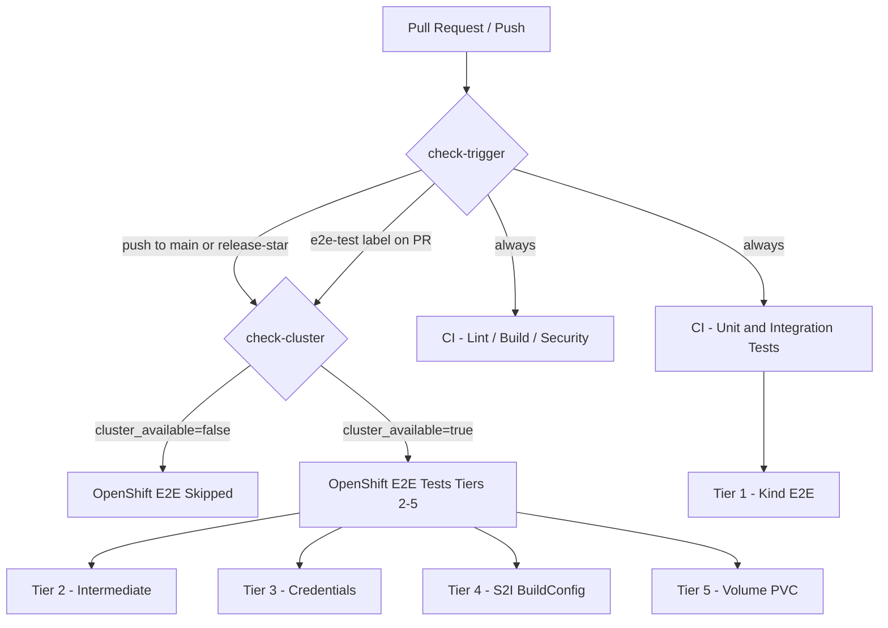

# CI Cluster Setup Guide

This guide explains how to register an OpenShift cluster for E2E testing, the
recommended cluster strategy, and how to trigger OpenShift tests on a PR or push.

Related ADRs: [ADR-033](adrs/033-e2e-testing-against-live-openshift-cluster.md),
[ADR-034](adrs/034-dual-testing-strategy-kind-and-openshift.md)

---

## CI Testing Topology



| Workflow | Cluster | Triggers | Always-on |
|---|---|---|---|
| `ci.yml` — lint / build / security | none | every push / PR | yes |
| `ci-unit-tests.yaml` — unit + Kind integration | Kind (ephemeral) | every push / PR | yes |
| `e2e-kind.yaml` — Tier 1 E2E | Kind (ephemeral) | every push / PR | yes |
| `e2e-openshift.yaml` — Tiers 2-5 E2E | live OCP cluster | push to `main`/`release-*`, or PR with `e2e-test` label | no — skips when no cluster registered |

---

## Cluster Strategy

**One cluster, always the current OCP stable stream.**

Do not maintain a version matrix. The project targets the current OpenShift
stable release (4.20 as of April 2026). When OpenShift releases a new minor
version, update the registered cluster and rotate the token.

Rationale:
- Keeps CI cost low (one cluster, not a fleet)
- Mirrors what customers run in production
- Tier 1 (Kind) already covers unit and basic integration continuously
- Full Tiers 2-5 validation is an on-demand gate, not a per-PR requirement

When you upgrade the cluster, update `OPENSHIFT_SERVER` and `OPENSHIFT_TOKEN`
in the GitHub repository secrets. No code changes are required.

---

## Service Account Setup

Create a dedicated least-privilege service account for CI rather than using
a personal token or `cluster-admin` credentials.

```bash
# Log in to your cluster as a cluster-admin
oc login --server=https://api.your-cluster.example.com:6443

# Create a dedicated namespace for the service account
oc create namespace ci-service-accounts

# Create the service account
oc create serviceaccount github-ci -n ci-service-accounts

# Grant permissions needed by the operator E2E tests:
#   - create/delete namespaces (test isolation)
#   - deploy the operator (CRDs, Deployments, RBAC)
#   - manage cert-manager resources
oc adm policy add-cluster-role-to-user cluster-admin \
  -z github-ci \
  -n ci-service-accounts

# Create a long-lived token secret (Kubernetes 1.24+ requires explicit Secret)
cat <<EOF | oc apply -f -
apiVersion: v1
kind: Secret
metadata:
  name: github-ci-token
  namespace: ci-service-accounts
  annotations:
    kubernetes.io/service-account.name: github-ci
type: kubernetes.io/service-account-token
EOF

# Wait for the token to be populated (a few seconds)
oc wait secret/github-ci-token -n ci-service-accounts \
  --for=jsonpath='{.data.token}' --timeout=30s

# Extract the token
oc get secret github-ci-token -n ci-service-accounts \
  -o jsonpath='{.data.token}' | base64 -d
```

Save the output — it is the value for the `OPENSHIFT_TOKEN` secret.

---

## Setting GitHub Secrets

Navigate to your GitHub repository:
**Settings → Secrets and variables → Actions → New repository secret**

### `OPENSHIFT_SERVER`

The OpenShift API server URL:

```bash
oc whoami --show-server
# Example output: https://api.cluster-c4r4z.c4r4z.sandbox5156.opentlc.com:6443
```

Set the secret value to that URL.

### `OPENSHIFT_TOKEN`

The service account token extracted in the previous section.

Alternatively, use the `gh` CLI:

```bash
OPENSHIFT_SERVER=$(oc whoami --show-server)
OPENSHIFT_TOKEN=$(oc get secret github-ci-token -n ci-service-accounts \
  -o jsonpath='{.data.token}' | base64 -d)

gh secret set OPENSHIFT_SERVER --body "$OPENSHIFT_SERVER"
gh secret set OPENSHIFT_TOKEN  --body "$OPENSHIFT_TOKEN"
```

Verify the secrets are set:

```bash
gh secret list
```

---

## Triggering OpenShift E2E Tests

### Automatic triggers

OpenShift E2E tests run automatically on every push to `main` or any
`release-*` branch — provided both `OPENSHIFT_SERVER` and `OPENSHIFT_TOKEN`
are set.

### On a pull request

OpenShift E2E tests are **not** triggered on every PR to save cluster
resources. To run them on a specific PR, add the `e2e-test` label:

```bash
# Add label via gh CLI
gh pr edit <PR-NUMBER> --add-label e2e-test

# Or add it in the GitHub UI: PR → Labels → e2e-test
```

The `check-trigger` job in `e2e-openshift.yaml` detects the label and
proceeds to the `check-cluster` availability check.

### Running a specific tier manually

Use the **workflow_dispatch** trigger via the GitHub Actions UI or CLI:

```bash
gh workflow run e2e-openshift.yaml \
  --field test_tier=2   # 1, 2, 3, 4, 5, or all
```

---

## Grey / Skipped OpenShift Badge

If neither `OPENSHIFT_SERVER` nor `OPENSHIFT_TOKEN` is set, the
`check-cluster` job outputs `cluster_available=false`, the `openshift-e2e`
job is skipped, and `e2e-status` exits successfully.

**A grey or skipped OpenShift E2E badge is expected and not a failure.**

```
[](...)
```

The badge will appear grey (no recent run) or show "skipped" when no cluster
is registered. This is by design (implemented in commit `10ae47f`). Only a
red badge — meaning the job ran and failed — requires investigation.

---

## Rotating the Token

Service account tokens should be rotated every 90 days or when the cluster
is replaced:

```bash
# Delete the old token secret to force regeneration
oc delete secret github-ci-token -n ci-service-accounts

# Re-create it
cat <<EOF | oc apply -f -
apiVersion: v1
kind: Secret
metadata:
  name: github-ci-token
  namespace: ci-service-accounts
  annotations:
    kubernetes.io/service-account.name: github-ci
type: kubernetes.io/service-account-token
EOF

oc wait secret/github-ci-token -n ci-service-accounts \
  --for=jsonpath='{.data.token}' --timeout=30s

# Update the GitHub secret
NEW_TOKEN=$(oc get secret github-ci-token -n ci-service-accounts \
  -o jsonpath='{.data.token}' | base64 -d)
gh secret set OPENSHIFT_TOKEN --body "$NEW_TOKEN"
```

---

## See Also

- [docs/GITHUB_SECRETS_SETUP.md](GITHUB_SECRETS_SETUP.md) — full secrets inventory for all CI workflows
- [.github/workflows/e2e-openshift.yaml](../.github/workflows/e2e-openshift.yaml) — `check-cluster` job implementation
- [ADR-033](adrs/033-e2e-testing-against-live-openshift-cluster.md) — E2E testing decision
- [ADR-034](adrs/034-dual-testing-strategy-kind-and-openshift.md) — dual testing strategy
