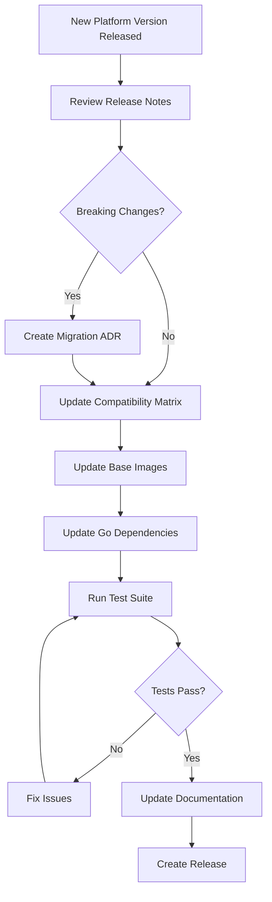

# ADR-029: Platform Version Dependency Review Process

**Status**: Accepted  
**Date**: 2025-11-09  
**Authors**: Sophia (AI Assistant), Tosin Akinosho  
**Related ADRs**: ADR-027 (S2I Build Strategy), ADR-028 (Tekton Task Strategy)

## Context

The Jupyter Notebook Validator Operator depends on multiple platform-specific APIs and base images that change across Kubernetes and OpenShift versions. Without a systematic dependency review process, operator upgrades can break when:

1. **Kubernetes API versions change** (e.g., v1beta1 → v1)
2. **OpenShift Pipelines versions change** (e.g., Tekton v1beta1 → v1)
3. **Base images are updated** (e.g., new SHA256 digests, deprecated images)
4. **CRD schemas evolve** (e.g., new required fields, deprecated fields)
5. **Security vulnerabilities** are discovered in dependencies

### Current Dependencies

**Platform APIs**:
- Kubernetes: 1.31.10 (OpenShift 4.18.21)
- OpenShift Build API: `build.openshift.io/v1`
- OpenShift Image API: `image.openshift.io/v1`
- Tekton Pipeline API: `tekton.dev/v1` (was `v1beta1`)

**Base Images**:
- Git Clone: `registry.redhat.io/openshift-pipelines/pipelines-git-init-rhel8@sha256:4fabae...`
- Buildah: `registry.redhat.io/rhel8/buildah@sha256:6d2dcb...`
- OpenShift AI Images: `image-registry.openshift-image-registry.svc:5000/redhat-ods-applications/s2i-*:2025.1`

**Go Dependencies**:
- `github.com/openshift/api` (Build, Image APIs)
- `github.com/tektoncd/pipeline` (Tekton APIs)
- `sigs.k8s.io/controller-runtime` (Kubernetes client)

### Problem Statement

**Without a systematic review process**:
- Operator may break on new OpenShift/Kubernetes versions
- Security vulnerabilities may go unnoticed
- API deprecations may cause runtime failures
- Base image updates may introduce breaking changes
- No clear upgrade path for users

## Decision

**We will implement a STRUCTURED DEPENDENCY REVIEW PROCESS** that is triggered:

1. **Before each operator release**
2. **When targeting a new OpenShift/Kubernetes version**
3. **Quarterly** (every 3 months) for security updates
4. **When critical CVEs are announced**

### Review Process Phases

#### Phase 1: Platform Version Matrix

**Maintain a compatibility matrix** in `docs/PLATFORM-COMPATIBILITY.md`:

```markdown
# Platform Compatibility Matrix

## Supported Versions

| Operator Version | OpenShift | Kubernetes | Tekton Pipelines | OpenShift AI |
|------------------|-----------|------------|------------------|--------------|
| 0.1.0            | 4.18.x    | 1.31.x     | 1.17.x           | 2025.1       |
| 0.2.0            | 4.18-4.19 | 1.31-1.32  | 1.17-1.18        | 2025.1-2025.2|

## API Versions Used

| API Group              | Version | Status     | Deprecated In | Removed In |
|------------------------|---------|------------|---------------|------------|
| build.openshift.io     | v1      | Stable     | N/A           | N/A        |
| image.openshift.io     | v1      | Stable     | N/A           | N/A        |
| tekton.dev (Pipeline)  | v1      | Stable     | N/A           | N/A        |
| tekton.dev (Task)      | v1      | Stable     | N/A           | N/A        |

## Base Image Versions

| Image                  | Current SHA256 | Last Updated | CVE Status |
|------------------------|----------------|--------------|------------|
| pipelines-git-init     | 4fabae...      | 2025-11-07   | ✅ Clean   |
| rhel8/buildah          | 6d2dcb...      | 2025-11-07   | ✅ Clean   |
```

#### Phase 2: Automated Dependency Scanning

**Implement automated checks in CI/CD**:

```yaml
# .github/workflows/dependency-review.yml
name: Dependency Review

on:
  schedule:
    - cron: '0 0 * * 0'  # Weekly on Sunday
  workflow_dispatch:

jobs:
  review-dependencies:
    runs-on: ubuntu-latest
    steps:
      - name: Check Go Dependencies
        run: |
          go list -m -u all
          go mod verify
      
      - name: Check for CVEs
        uses: aquasecurity/trivy-action@master
        with:
          scan-type: 'fs'
          scan-ref: '.'
          format: 'sarif'
          output: 'trivy-results.sarif'
      
      - name: Check Base Image Vulnerabilities
        run: |
          # Scan base images for CVEs
          trivy image registry.redhat.io/openshift-pipelines/pipelines-git-init-rhel8:latest
          trivy image registry.redhat.io/rhel8/buildah:latest
      
      - name: Check API Deprecations
        run: |
          # Use pluto to detect deprecated Kubernetes APIs
          pluto detect-files -d .
```

#### Phase 3: Manual Review Checklist

**Before each release, complete this checklist**:

```markdown
# Dependency Review Checklist

## Platform APIs
- [ ] Check Kubernetes API deprecations for target version
- [ ] Check OpenShift API changes in release notes
- [ ] Verify Tekton Pipeline API compatibility
- [ ] Test against target OpenShift version
- [ ] Test against target Kubernetes version

## Base Images
- [ ] Check for new base image versions
- [ ] Scan base images for CVEs
- [ ] Verify base image SHA256 digests
- [ ] Test with updated base images
- [ ] Update image references in code

## Go Dependencies
- [ ] Run `go mod tidy`
- [ ] Run `go mod verify`
- [ ] Check for security advisories
- [ ] Update dependencies with `go get -u`
- [ ] Run full test suite after updates

## CRD Schemas
- [ ] Check for CRD schema changes
- [ ] Verify backward compatibility
- [ ] Update CRD definitions if needed
- [ ] Test CRD upgrades

## Documentation
- [ ] Update PLATFORM-COMPATIBILITY.md
- [ ] Update installation docs with version requirements
- [ ] Document breaking changes in CHANGELOG.md
- [ ] Update upgrade guide if needed
```

#### Phase 4: Version-Specific Testing

**Implement version-specific test matrix**:

```yaml
# .github/workflows/platform-matrix-test.yml
name: Platform Matrix Testing

on:
  pull_request:
    branches: [main, release-*]

jobs:
  test-matrix:
    strategy:
      matrix:
        platform:
          - openshift: "4.18"
            kubernetes: "1.31"
            tekton: "1.17"
          - openshift: "4.19"
            kubernetes: "1.32"
            tekton: "1.18"
    runs-on: ubuntu-latest
    steps:
      - name: Setup Test Cluster
        run: |
          # Setup cluster with specific versions
          # Run operator tests
          # Verify functionality
```

#### Phase 5: Upgrade Path Documentation

**Document upgrade procedures** in `docs/UPGRADE-GUIDE.md`:

```markdown
# Upgrade Guide

## Upgrading from 0.1.0 to 0.2.0

### Prerequisites
- OpenShift 4.18+ or Kubernetes 1.31+
- Tekton Pipelines 1.17+

### Breaking Changes
- None

### Upgrade Steps
1. Backup existing CRDs
2. Update operator deployment
3. Verify operator health
4. Test with sample workload

### Rollback Procedure
1. Restore operator to previous version
2. Verify functionality
```

### Dependency Update Workflow

**When a new platform version is released**:



## Implementation Strategy

### Immediate (This Week)

1. ✅ Create ADR-029 documenting review process
2. ⏳ Create `docs/PLATFORM-COMPATIBILITY.md` with current versions
3. ⏳ Create `docs/UPGRADE-GUIDE.md` template
4. ⏳ Add dependency review checklist to release process
5. ⏳ Document current base image versions and SHA256 digests

### Short-Term (This Month)

1. Add automated dependency scanning to CI/CD
2. Implement CVE scanning for base images
3. Add API deprecation detection
4. Create platform matrix testing workflow
5. Test operator on OpenShift 4.19 (when available)

### Long-Term (Ongoing)

1. Quarterly dependency reviews
2. Automated alerts for CVEs
3. Automated base image updates (with testing)
4. Community feedback on compatibility issues
5. Maintain compatibility with N-1 platform versions

## Consequences

### Positive

1. **✅ Proactive Issue Detection**: Catch breaking changes before users do
2. **✅ Security Posture**: Regular CVE scanning and updates
3. **✅ Clear Upgrade Path**: Users know what versions are supported
4. **✅ Reduced Support Burden**: Fewer compatibility issues
5. **✅ Professional Quality**: Demonstrates mature engineering practices
6. **✅ Community Trust**: Users trust operator works on their platform

### Negative

1. **⚠️ Maintenance Overhead**: Regular reviews require time
2. **⚠️ Testing Complexity**: Need to test multiple platform versions
3. **⚠️ Documentation Burden**: Keep compatibility matrix updated
4. **⚠️ CI/CD Complexity**: More workflows and checks

### Neutral

1. **📊 Release Cadence**: May slow down releases for thorough testing
2. **📊 Version Support**: Need to decide how many versions to support

## Alternatives Considered

### Alternative 1: No Formal Process

**Pros**: Less overhead, faster development

**Cons**: 
- ❌ Breaks on new platform versions
- ❌ Security vulnerabilities unnoticed
- ❌ Poor user experience

**Rejected**: Unacceptable for production operator

### Alternative 2: Only Test on Latest Version

**Pros**: Simpler testing, less maintenance

**Cons**:
- ❌ Users on older versions unsupported
- ❌ Upgrade path unclear
- ❌ Enterprise users need N-1 support

**Rejected**: Doesn't meet enterprise requirements

### Alternative 3: Automated Updates Only

**Pros**: Always up-to-date, minimal manual work

**Cons**:
- ❌ Breaking changes may slip through
- ❌ No human review of changes
- ❌ May break production deployments

**Rejected**: Too risky without human review

## References

- [Kubernetes API Deprecation Policy](https://kubernetes.io/docs/reference/using-api/deprecation-policy/)
- [OpenShift Release Notes](https://docs.openshift.com/container-platform/latest/release_notes/)
- [Tekton Pipeline Releases](https://github.com/tektoncd/pipeline/releases)
- [Trivy Vulnerability Scanner](https://github.com/aquasecurity/trivy)
- [Pluto - Kubernetes Deprecation Detector](https://github.com/FairwindsOps/pluto)

## Notes

- This ADR establishes the process, not the specific versions
- Compatibility matrix will be maintained separately
- Review process should be lightweight but thorough
- Automation should assist, not replace, human judgment
- Community feedback is essential for compatibility testing

